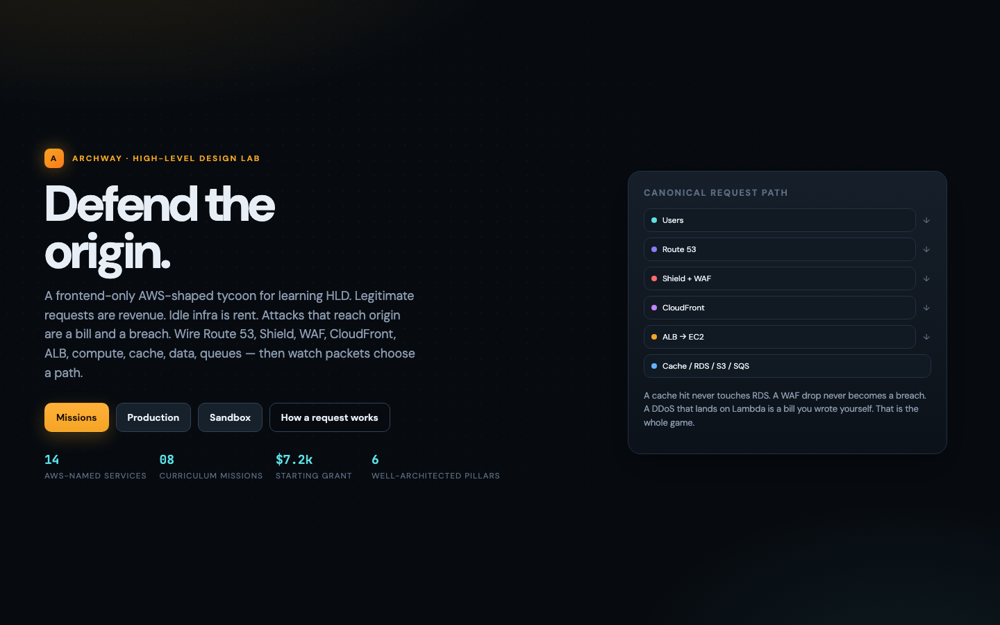
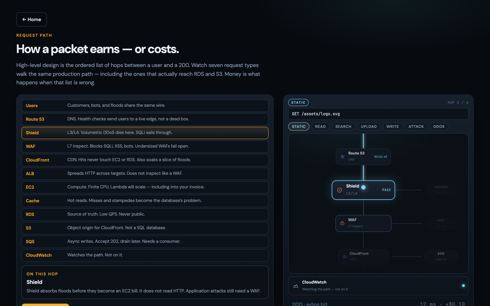
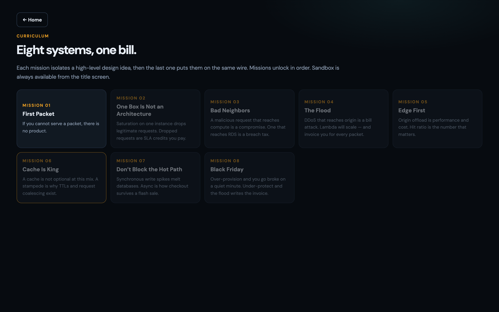
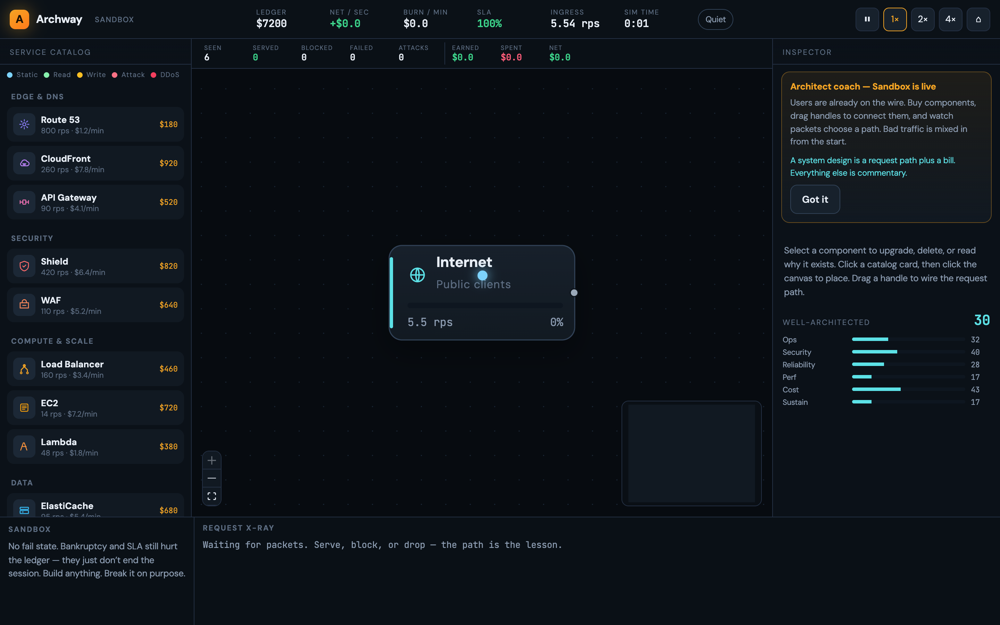

<p align="center">
  <a href="https://akgarhwal.github.io/archway/">
    
  </a>
</p>

<h1 align="center">Archway</h1>
<p align="center"><strong>Defend the origin.</strong></p>
<p align="center">
  You get <strong>$7,200</strong>. That is exactly ten EC2s.<br />
  Which is the trap.
</p>
<p align="center">
  <a href="https://akgarhwal.github.io/archway/"><strong>▶&nbsp; Play in the browser — no signup</strong></a><br />
  <sub>8 minutes · runs entirely in the tab · DDoS is a bill attack</sub>
</p>

---

System design is usually a whiteboard. Archway is a live wire.

Customers, bots, and floods share the same path. Legitimate requests **print money**. Idle infrastructure **collects rent**. An attack that reaches origin is not a lore event — it is an invoice, and maybe a breach.

If you scale the origin to eat garbage, Lambda will happily help, and then bill you for the privilege.

**[Open the lab →](https://akgarhwal.github.io/archway/)**

## The whole game is one sentence

A cache hit never touches RDS. A WAF drop never becomes a breach. A DDoS that lands on Lambda is a bill you wrote yourself.

<p align="center">
  <a href="https://akgarhwal.github.io/archway/">
    
  </a>
</p>

Watch seven request types walk the same production path — including the ones that should never be allowed to see RDS.

```
Users → Route 53 → Shield → WAF → CloudFront
          ├─ HIT  → done. Origin never billed.
          └─ MISS → ALB → EC2 / Lambda
                        ├─ cache HIT → done
                        ├─ miss → RDS / DynamoDB
                        ├─ static → S3
                        └─ SQS → worker → RDS
CloudWatch watches. It is not a hop.
```

## Eight systems. One bill. The last one is Black Friday.

<p align="center">
  
</p>

Each mission isolates one idea you think you already know — until the packet proves you don’t.

| # | Mission | What it forces you to feel |
|---:|---|---|
| 01 | **First Packet** | If you cannot serve, there is no product. |
| 02 | **One Box Is Not an Architecture** | An ALB with one target is a single point of failure with extra latency. |
| 03 | **Bad Neighbors** | A load balancer will happily spread SQLi to every instance you own. |
| 04 | **The Flood** | More EC2 is how you *pay* to process the attack. |
| 05 | **Edge First** | If EC2 is serving PNGs, you are burning the wrong resource. |
| 06 | **Cache Is King** | Then the stampede hits, and RDS sees everyone at once. |
| 07 | **Don’t Block the Hot Path** | A queue without a worker is a black hole. |
| 08 | **Black Friday** | Hold the SLA. Stay solvent. Score 70 on Well-Architected. |

Then **Sandbox** (pause, break things) and **Production** (you cannot pause — traffic breathes).

<p align="center">
  <a href="https://akgarhwal.github.io/archway/">
    
  </a>
</p>

Over-provision and you go broke on a quiet minute. Under-protect and the flood writes the invoice.

**[I want to go bankrupt myself →](https://akgarhwal.github.io/archway/)**

## Play locally

```bash
npm install
npm run dev
```

Open the URL Vite prints (`http://localhost:5173`). Same game, no deploy.

## Controls

| Input | Action |
|---|---|
| Drag catalog → canvas | Place a service |
| Drag a handle | Wire the request path |
| Click **×** or double-click a wire | Disconnect |
| Space | Pause / resume *(not in live Production)* |
| 1 / 2 / 4 | Sim speed |
| Delete | Sell selected node (50% refund) |
| Esc | Cancel placement / deselect |

## Stack

Vite · React · TypeScript · React Flow · Zustand. Saves are `localStorage` only. There is no backend to betray you.

Push to `main` and GitHub Actions publishes Pages: [akgarhwal.github.io/archway](https://akgarhwal.github.io/archway/).

Spec: [`REQUIREMENTS.md`](./REQUIREMENTS.md).
